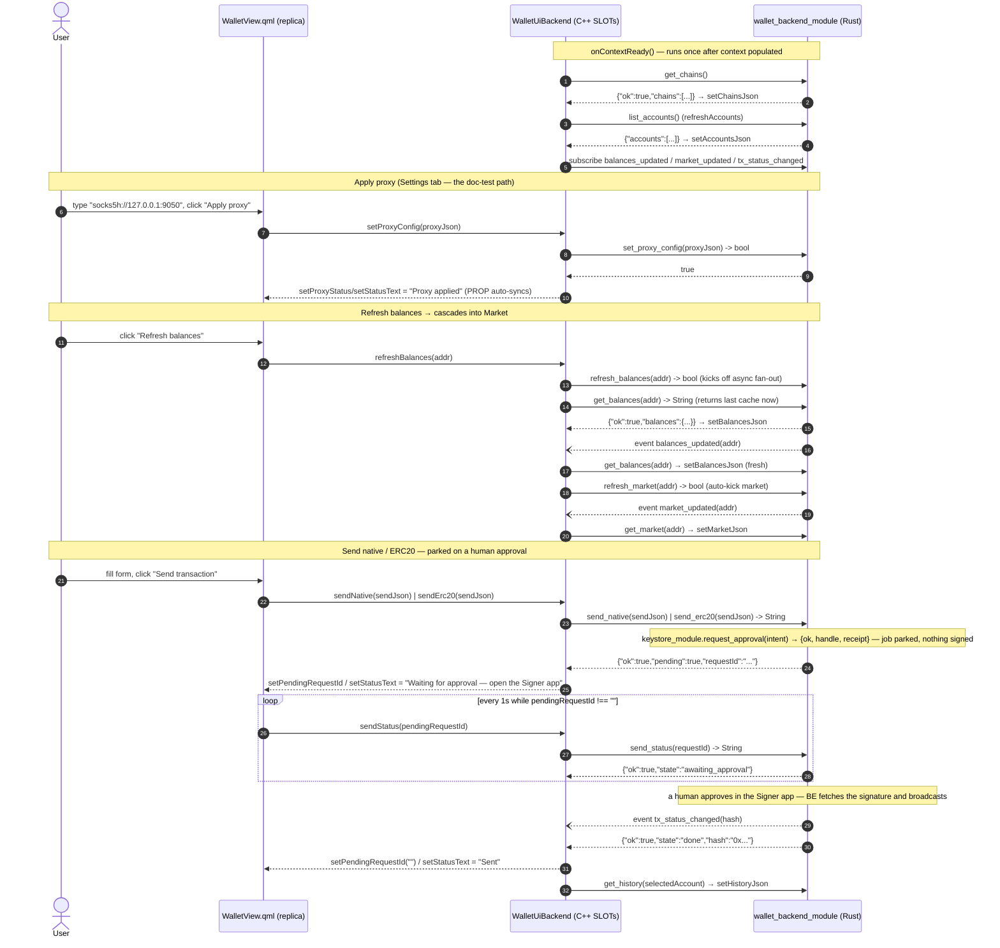

# `logos-evm-wallet-ui` — Specification & Reference

## Purpose

`logos-evm-wallet-ui` is the **Metamask-like graphical front-end** for the Logos
multi-chain EVM wallet. It is a **universal C++ `ui_qml` Logos module**: a hand-written
C++/QtRO backend (`WalletUiBackend`) paired with a single QML view (`qml/WalletView.qml`).
The QML view renders the wallet (seven tabs — **Balances, Market, Send, Tokens, History,
Settings, Advanced**); the C++ backend turns every UI gesture into a typed call against
[`wallet_backend_module`](https://github.com/logos-co/logos-evm-wallet-backend-module)
over the Logos bridge and pushes the backend's JSON results (and live events) back into
QtRO properties that the QML view auto-binds to.

The UI itself holds **no chain logic, no keys, and no network code**. It is a thin
presentation/coordination layer: all balances, token lists, prices, send
orchestration, history, and proxy/privacy enforcement live in `wallet_backend_module`
and the modules below it. The UI never talks to an RPC endpoint or a keystore directly —
it only drives the backend. Signing is not the wallet's to do: a send raises a signing
request through `keystore_module` and a **human approves it in a separate Signer app**.
The wallet never takes a password in order to sign and has no unlocked state; it parks
the request id in `pendingRequestId` and polls `sendStatus` until the decision lands.

> **Note on the README.** The repo's `README.md` describes an older "QML-only, no
> C++/QtRO backend" design where QML drove the backend directly via `logos.callModule`.
> The current source (this commit) is the **universal C++ backend** model: `metadata.json`
> declares `"interface": "universal"` with a `codegen.rep` contract, `CMakeLists.txt`
> builds `src/wallet_ui_backend.{h,cpp}`, and the QML talks to a generated C++ replica
> (`logos.module("wallet_ui")`) rather than calling the backend module directly. This
> document reflects the **source**, which is authoritative.

### Where this repo sits in the EVM-wallet system

```
            ┌──────────────────────────────────────────────────────────┐
            │  logos-evm-wallet-ui   ← YOU ARE HERE                     │
            │  universal ui_qml: C++ QtRO backend + QML view           │
            └──────────────────────────────┬───────────────────────────┘
                                           │ typed modules().wallet_backend_module.*
                                           │ (Logos bridge / QtRO)
                                           ▼
            ┌──────────────────────────────────────────────────────────┐
            │  wallet_backend_module   (Rust coordinator + alloy)      │
            └───┬───────────────┬───────────────┬──────────────┬───────┘
                │               │               │              │
         keystore_module   eth_rpc_module  token_list_module  uniswap_module
         (keys, signing)   (multi-chain    (token lists)      (V2/V3/V4 prices,
                            JSON-RPC,                           swaps)
                            concurrency:multi)                  (concurrency:multi)
                                │               │              │
                                ▼               ▼              │
                         logos-evm-net-proxy (fail-closed HTTP)◄┘
```

The UI declares **all** of `eth_rpc_module`, `keystore_module`, `token_list_module`,
`uniswap_module`, and `wallet_backend_module` as dependencies (`metadata.json#dependencies`
and `flake.nix` inputs), but it **only calls** `wallet_backend_module`. The leaf modules
are declared so that the bundled standalone app can auto-load the entire dependency tree
in the right order — without them the backend can't load and the UI's calls would time
out.

---

## Overall architecture

The repo is a universal `ui_qml` module. The author writes exactly three artifacts — the
`.rep` view contract, the C++ backend that implements it, and the QML view. Everything
else (the `*Plugin` glue, `Q_PLUGIN_METADATA`, `initLogos` wiring, QtRO replica
registration, the generated `modules()` umbrella, and the standalone-app shell) is
generated by `logos-module-builder` (`mkLogosQmlModule`).

```mermaid
flowchart TB
    subgraph repo["logos-evm-wallet-ui (this repo — author-written files)"]
        rep["src/wallet_ui.rep<br/>QtRO view contract:<br/>10 PROPs (READONLY/READWRITE)<br/>15 SLOTs"]
        h["src/wallet_ui_backend.h<br/>WalletUiBackend :<br/>WalletUiSimpleSource +<br/>LogosUiPluginContext"]
        cpp["src/wallet_ui_backend.cpp<br/>SLOT implementations +<br/>onContextReady() event wiring"]
        qml["qml/WalletView.qml<br/>7-tab Metamask-like view<br/>(objectName walletRoot)"]
        meta["metadata.json<br/>type ui_qml / interface universal<br/>view + codegen.rep + deps"]
        cmake["CMakeLists.txt<br/>logos_module(REP_FILE...)"]
    end

    subgraph gen["Generated by logos-module-builder (mkLogosQmlModule)"]
        repc["repc → WalletUiSimpleSource (source)<br/>+ WalletUiReplica (QML side)"]
        plug["wallet_ui_plugin<br/>Q_PLUGIN_METADATA, initLogos(),<br/>QtRO host registration"]
        sdk["logos_sdk.h → modules()<br/>typed callers + typed events<br/>for wallet_backend_module"]
        app["apps.default = standalone app shell<br/>(logos-standalone-app: --width/--height)<br/>bundles + auto-loads backend tree"]
    end

    subgraph runtime["Runtime surfaces"]
        replica["QML replica:<br/>logos.module(\"wallet_ui\")<br/>PROPs auto-sync, SLOTs callable"]
        backend_dep[("wallet_backend_module<br/>over the Logos bridge")]
    end

    rep --> repc
    repc --> h
    h --> cpp
    cpp -->|"modules().wallet_backend_module.*"| sdk
    meta --> plug
    cmake --> plug
    rep --> plug
    h --> plug
    qml --> replica
    repc --> replica
    plug --> replica
    replica -->|"PROP reads + SLOT calls (QtRO)"| cpp
    sdk -->|"typed RPC over bridge"| backend_dep
    backend_dep -->|"return JSON strings + events"| sdk
    meta --> app
    app --> backend_dep

    classDef authored fill:#1f6feb,stroke:#0b3a8c,color:#fff;
    classDef generated fill:#6e40c9,stroke:#3d2475,color:#fff;
    classDef rt fill:#2e7d32,stroke:#14471a,color:#fff;
    class rep,h,cpp,qml,meta,cmake authored;
    class repc,plug,sdk,app generated;
    class replica,backend_dep rt;
```

### The three layers

| Layer | File(s) | Role |
|-------|---------|------|
| **View contract** | `src/wallet_ui.rep` | QtRO `class WalletUi` — declares 10 `PROP`s (state pushed to QML) and 15 `SLOT`s (UI-callable methods). `repc` generates `WalletUiSimpleSource` (C++ side) and a replica (QML side). |
| **C++ backend** | `src/wallet_ui_backend.{h,cpp}` | `WalletUiBackend` implements every SLOT and feeds the PROPs. It derives `WalletUiSimpleSource` (generated source object) and `LogosUiPluginContext` (gives `onContextReady()` + `modules()`). |
| **QML view** | `qml/WalletView.qml` | The visible UI. Binds to `logos.module("wallet_ui")` PROPs and calls its SLOTs. Root `Item` has `objectName: "walletRoot"` with a `selectTab(i)` helper. |

### State flow (one round-trip)

1. The user acts in QML (clicks **Refresh balances**, types a proxy URL, etc.).
2. QML calls a SLOT on the replica, e.g. `backend.refreshBalances(addr)`.
3. QtRO marshals the call to the C++ `WalletUiBackend` SLOT.
4. The backend calls `modules().wallet_backend_module.<method>(...)` over the Logos
   bridge — a typed RPC into the Rust backend module.
5. The backend writes the JSON result (or a fixed status string) into a PROP via a
   generated setter (`setBalancesJson(...)`, `setStatusText(...)`).
6. QtRO auto-syncs the PROP to the QML replica; QML's property bindings re-render.

For **events** (live updates not triggered by a UI action), the backend subscribes once
in `onContextReady()` to `wallet_backend_module`'s events (`balances_updated`,
`market_updated`, `tx_status_changed`) and re-pulls the corresponding PROP when one fires.

---

## Communication with `wallet_backend_module`

Every method the C++ backend calls is `modules().wallet_backend_module.<name>(...)` (typed
caller generated from `metadata.json#dependencies`). The names and signatures below are the
**exact** backend trait methods (verified against `wallet-backend-module/rust-lib/src/glue.rs`).

### Outbound calls and subscribed events



### Complete outbound call map

Each UI method maps 1:1 (or 1:N) to backend trait calls. `→` means "writes this PROP from
the result".

| UI backend SLOT | Backend call(s) `modules().wallet_backend_module.…` | PROP(s) updated |
|---|---|---|
| `onContextReady()` (lifecycle) | `get_chains()`, then `refreshAccounts()`; subscribes `balances_updated`, `market_updated`, `tx_status_changed` | `chainsJson`, (via refresh) `accountsJson`, `statusText` |
| `setProxyConfig` | `set_proxy_config(proxyJson)` | `proxyStatus`, `statusText` |
| `setChains` | `set_chains(chainsJson)`; on success `get_chains()` | `chainsJson`, `statusText` |
| `testEndpoint` | `test_endpoint(chainId)` | — (returns to caller) |
| `createAccount` | **not the backend** — `keystore_module.configure(roles)`, then `keystore_module.create_unrelated_account(params)`, then `refreshAccounts()` | `accountsJson`, `statusText` |
| `importMnemonic` | `import_mnemonic(phraseJson, label)`; then `refreshAccounts()` | `accountsJson`, `statusText` |
| `refreshAccounts` | `list_accounts()` | `accountsJson` |
| `sendStatus` | `send_status(requestId)` — polled every 1s by the QML Timer while `pendingRequestId != ""` | `pendingRequestId` (cleared on `done`/`declined`), `statusText`, `historyJson` (on `done`, via `refreshHistory`) |
| `refreshBalances` | `refresh_balances(address)` (async kick), then `get_balances(address)` | `balancesJson`, `statusText` |
| `loadTokens` | `get_tokens(chainId)` | `tokensJson` |
| `addCustomToken` | `add_custom_token(tokenJson)` | `statusText` |
| `refreshMarket` | `refresh_market(address)` | `statusText` (result lands via event → `marketJson`) |
| `estimateFee` | `estimate_fee(sendJson)` | — (returns to caller) |
| `sendNative` | `send_native(sendJson)` | `pendingRequestId`, `statusText` (returns `{"ok":true,"pending":true,"requestId":…}`; status becomes "Waiting for approval — open the Signer app", or "Send failed" when `ok` is false) |
| `sendErc20` | `send_erc20(sendJson)` | `pendingRequestId`, `statusText` (returns `{"ok":true,"pending":true,"requestId":…}` — on `ok` the status becomes "Waiting for approval — open the Signer app", otherwise "Send failed") |
| `refreshHistory` | `get_history(address)` | `historyJson` |
| **event** `balances_updated(addr)` | `get_balances(addr)` + `refresh_market(addr)` | `balancesJson` (and later `marketJson`) |
| **event** `market_updated(addr)` | `get_market(addr)` | `marketJson` |
| **event** `tx_status_changed(_)` | `get_history(selectedAccount())` (if a selection exists) | `historyJson` |

---

## Full API reference

The public surface is the QtRO **view contract** in `src/wallet_ui.rep`: **12 properties**
the QML view reads, and **20 slots** the QML view (or a headless qt-mcp driver) calls. All
slots are implemented in `WalletUiBackend` (`src/wallet_ui_backend.cpp`); the corresponding
backend method's return shape is documented under each.

### Properties (state pushed to QML)

PROPs are set in C++ via generated setters (`setStatusText`, `setBalancesJson`, …) and
auto-synced to the QML replica, where the view reads them as `backend.<prop>`.

| Property | Type | Access | Meaning | Backing setter call |
|---|---|---|---|---|
| `statusText` | `QString` | READONLY | Human-readable status line (shown below the tabs). Initial value `"Ready"`. | many slots |
| `chainsJson` | `QString` | READONLY | JSON `{"ok":true,"chains":[…]}` of configured chains. | `get_chains()` |
| `accountsJson` | `QString` | READONLY | JSON `{"ok":true,"accounts":["0x…"]}` — the keystore's account addresses as bare strings, bound directly as the account combo box model. | `list_accounts()` |
| `selectedAccount` | `QString` | **READWRITE** | The address selected in the account combo box. QML writes it on selection; the `tx_status_changed` handler reads it. | (QML-driven) |
| `pendingRequestId` | `QString` | READONLY | The id of the signing request awaiting a human in the Signer app, or `""` when nothing is pending — there is no "unlocked" state any more. A QML `Timer` polls `sendStatus(pendingRequestId)` once a second while it is non-empty. Initial `""`. | set by `sendNative`/`sendErc20`, cleared by `sendStatus` |
| `balancesJson` | `QString` | READONLY | JSON `{"ok":true,"balances":{address,chains:[…]}}` aggregate. | `get_balances()` |
| `tokensJson` | `QString` | READONLY | JSON `{"tokens":[…]}` token list for a chain. | `get_tokens()` |
| `historyJson` | `QString` | READONLY | JSON `{"ok":true,"history":[…]}` local tx records. | `get_history()` |
| `marketJson` | `QString` | READONLY | JSON `{"ok":true,"address","chains":[{chainId,items:[…]}]}` Uniswap-priced holdings. | `get_market()` |
| `proxyStatus` | `QString` | READONLY | `"Proxy applied"` / `"Proxy failed"` after a proxy apply. Initial `""`. | `setProxyConfig` |
| `privateSyncJson` | `QString` | READONLY | JSON `{"sync":{leg,state,percent,blocksRemaining,etaMs,…}}` — the RAILGUN accumulator sync a private send waits on. `state` is `idle` / `running` / `done` / `cancelled` / `unavailable`; the module's own plan fields are passed through unchanged. | `railgun_module.sync_status` / `sync_step` / `sync_cancel` (`web` variant only) |
| `privateSendJson` | `QString` | READONLY | JSON `{"send":{state,leg,legs:[{name,state}],cancellable,requestId?,userOpHash?,note?,error?}}` — the private send the sync above is one leg of. `legs` is the whole route in order (`sync`, `prove`, `approve`, `broadcast`), each `pending` / `running` / `done` / `skipped` / `cancelled` / `failed`. | `railgun_module.relayed_send` / `relayed_send_status` / `relayed_send_cancel` (`web` variant only) |

### Slots (UI-callable methods)

Each entry gives the **exact** signature from `src/wallet_ui.rep`, parameter meanings, the
backend call(s) it makes, the success/error shape, and an example. Slots that return a
`QString` return the backend's JSON string verbatim; `bool`/`void` slots update PROPs and/or
return a status flag. Backend JSON returns use the convention `{"ok":true,…}` on success and
`{"ok":false,"error":"…"}` on failure (`err(e)` in the backend).

---

#### Config / privacy

##### `bool setProxyConfig(QString proxyJson)`

Applies the privacy proxy configuration to the backend (pushed down to the net-proxy used
by eth-rpc and token-list).

- **`proxyJson`** — JSON object. The QML Settings tab sends
  `{"proxy": "<socks5h url>"|null, "proxyRequired": <bool>}`.
- **Backend call:** `set_proxy_config(proxyJson) -> bool`.
- **Returns:** `true` if applied. Sets `proxyStatus` and `statusText` to
  `"Proxy applied"` (success) or `"Proxy failed"` (failure).
- **Example (QML):**
  `backend.setProxyConfig(JSON.stringify({proxy:"socks5h://127.0.0.1:9050", proxyRequired:true}))`

##### `bool setChains(QString chainsJson)`

Replaces the chain configuration in the backend and re-pulls `chainsJson`.

- **`chainsJson`** — JSON **array** of chain configs, each
  `{"chainId":<int>,"name":"…","rpcUrl":"…","nativeSymbol":"…","multicall3":"0x…"?,"explorer":"…"?}`
  (`ChainInfo`, camelCase; a bare object is rejected). It **replaces** the whole chain list,
  so the QML Advanced tab upserts into the current `chainsJson` before sending.
- **Backend call:** `set_chains(chainsJson) -> bool`; on success `get_chains()` →
  `chainsJson` PROP.
- **Returns:** `true` on success. `statusText` = `"Chains updated"` or `"Set chains failed"`.

##### `QString testEndpoint(int chainId)`

Verifies the configured RPC endpoint for a chain (round-trips a `chainId` check through
eth-rpc).

- **`chainId`** — numeric EVM chain id.
- **Backend call:** `test_endpoint(chainId) -> String` (delegates to
  `eth_rpc_module.verify_chain_id`).
- **Returns (success):** the backend's JSON verification result (e.g. the matched chainId);
  **error:** `{"ok":false,"error":"…"}`.

---

#### Accounts (signing stays in `keystore_module`)

The UI never sees private keys. Account creation/import returns only public metadata; the
key material is held inside `keystore_module`.

##### `QString createAccount(QString passphrase, QString label)`

Creates a brand-new **unrelated** account — a key no recovery phrase covers, which is the
only kind this wallet can mint because it holds no seed.

- **`passphrase`** — passphrase that encrypts the new key at rest.
- **`label`** — accepted and **dropped**. It used to reach `labels.json` through the
  backend's `create_account`, which no longer exists; nothing stores it today.
- **Keystore calls, in order and CHAINED** (not through `wallet_backend_module`, which gave
  account mutation up when it became Tier D):
  1. `keystore_module.configure(rolesJson)` — creating an account belongs to the
     **custodian**, whose built-in default `evm_keystore_ui` does not exist in this
     workspace. `configure` is TOTAL, so the document names the full set:
     `{"approvers": "evm_signer_ui", "custodians": ["evm_keystore_ui", "wallet_ui"]}` —
     adding this module rather than replacing the defaults.
  2. `keystore_module.create_unrelated_account({passphrase, acknowledgeUnrecoverable: true})`
     — the keystore refuses to mint an unrecoverable key unless the caller acknowledges it,
     and the New-account dialog *is* that acknowledgement.

  The `web` variant additionally asks `keystore_module.caller_identity()` first and announces
  the answer: Tier D admits a plainly named module only, and on a phone there is no other way
  to see which identity the keystore assigned.
- **Returns:** the keystore JSON for the new account, or the refusal from whichever of the
  two calls failed. `statusText` = `"Account created"` or `"Account creation refused"`.

##### `QString importMnemonic(QString phraseJson, QString label)`

Imports an account from a BIP-39 mnemonic.

- **`phraseJson`** — JSON carrying the mnemonic phrase (and optional derivation params) in
  the shape the backend/keystore expects.
- **`label`** — label for the imported account.
- **Backend call:** `import_mnemonic(phraseJson, label) -> String`; then `refreshAccounts()`.
- **Returns:** backend JSON for the imported account. `statusText` = `"Account imported"`.
- **`web` variant (#147):** no coordinator, so the phrase document goes straight to
  `keystore_module.import_mnemonic(phraseJson)` — preceded by the same
  `caller_identity` + `configure` pair `createAccount` runs, because importing a key is
  **Tier D** and the role has to be in force before the mutation is asked for. The
  document is forwarded **whole**, so every optional field the keystore understands
  (`passphrase`, `storage`, `bip44Account`, `groupLabel`, …) reaches it. The **label**
  then goes to `keystore_module.set_label(address, label, password)` — there is no
  coordinator here to keep a `labels.json` of its own — and a refused label is reported
  beside `"Account imported"` (`"Account imported — label not set: …"`) rather than in
  place of it: the key is in the keystore either way. An empty phrase is refused here,
  without a round trip (`"Import needs a seed phrase"`).

  Until #147 this method answered *"Mnemonic import needs keystore_module, which has no
  mobile build"* and made no call at all, while the keystore — itself a `web` variant on
  a phone — was loaded and answering `list_accounts` in the same run. That wording is for
  a module that really is absent (`wallet_backend_module` is the last one); a method
  this variant has not implemented says so in its own words.

##### `void refreshAccounts()`

Re-pulls the account list into `accountsJson`.

- **Backend call:** `list_accounts() -> String` → `accountsJson` PROP.
- **Returns:** nothing (updates the PROP).

---

#### Balances + tokens

##### `void refreshBalances(QString address)`

Triggers a fresh multi-chain balance fetch and immediately shows the last cache.

- **`address`** — `0x…` account address to refresh.
- **Backend calls:** `refresh_balances(address) -> bool` (kicks off the async per-chain
  fan-out; the fresh result arrives later via the `balances_updated` event), then
  `get_balances(address) -> String` to populate `balancesJson` with the current cache now.
- **Returns:** nothing. `statusText = "Refreshing balances…"`.
- **Live update:** when the fan-out completes, `balances_updated(address)` fires →
  `balancesJson` is re-pulled **and** `refresh_market(address)` is auto-kicked.

##### `void loadTokens(int chainId)`

Loads the token list for a chain into `tokensJson`.

- **`chainId`** — numeric chain id.
- **Backend call:** `get_tokens(chainId) -> String` → `tokensJson`.
- **Returns:** nothing.
- **`web` variant (#148):** no coordinator, so it asks `token_list_module` itself —
  `get_tokens(chainId)`, and **nothing else**. Unlike a balance or a price there is no
  `eth_rpc_module.set_chain_config` first: a token list is metadata that module holds,
  not an RPC round trip. There is no `configure` either — an unconfigured
  `token_list_module` already serves the Uniswap default list compiled into its binary
  (1709 rows), so the first tap on this tab performs **no network I/O**. Fetching the
  live lists is that module's `refresh_now`, which goes through its fail-closed proxy;
  nothing in this variant schedules it. The rows are republished as `{"tokens":[…]}`
  and `statusText` becomes `"<n> token(s) on chain <id>"`; a refusal carries
  token_list's own words (`"token_list_module refused chain <id>: …"`) and **empties**
  the tab, because it shows one chain at a time and leaving the previous chain's rows
  up would be wrong with nothing to see.

##### `bool addCustomToken(QString tokenJson)`

Adds a user-defined custom token to that chain's list.

- **`tokenJson`** — JSON token descriptor. The QML "Add custom token" dialog sends
  `{"chainId":<int>,"address":"0x…","name":"…","symbol":"…","decimals":<int>}`.
- **Backend call:** `add_custom_token(tokenJson) -> bool`.
- **Returns:** `true` on success. `statusText` = `"Token added"` / `"Add token failed"`.
- **`web` variant (#148):** goes to `token_list_module.add_custom_token(tokenJson)`. The
  only door out of a wasm image is asynchronous while this slot is a synchronous `bool`,
  so `true` here means **the ask was taken**, not that it was stored; the outcome lands on
  `statusText`, which is the only channel the QML dialog reads anyway. A document this
  image can see is wrong — no `address`, or no chain — is refused **here**, without a
  round trip (`"A custom token needs a chain and an address"`), because
  `add_custom_token` answers a bare bool and a `false` from the module would be
  indistinguishable from any other refusal. On success the chain **the token was added
  on** is re-read, so the new row is visible without a second tap.

---

#### Market (Uniswap prices for held tokens)

##### `void refreshMarket(QString address)`

Kicks off the per-chain price fan-out for the account's held tokens.

- **`address`** — `0x…` account address.
- **Backend call:** `refresh_market(address) -> bool`. The backend asks `uniswap_module`
  (`concurrency:"multi"`) for prices across chains concurrently; the priced result is cached
  and surfaced via the `market_updated` event, which the UI handles by calling
  `get_market(address)` → `marketJson`.
- **Returns:** nothing. `statusText` transitions `"Loading market…"` → `"Market updated"`.
- **`web` variant (#148):** no coordinator, so it asks `uniswap_module` itself — one
  `get_prices(chainId, {"tokens":[]})` per configured chain, each preceded by the same
  `eth_rpc_module.set_chain_config` step a balance takes (uniswap's price *is* a Multicall3
  `eth_call` issued back through eth_rpc). The token list it passes stays empty even now
  that `token_list_module` is on the phone: what that module publishes is a **catalogue**
  (1709 rows, 401 of them on mainnet), not a watch list, and `get_prices` is a Multicall3
  batch — pricing every row would spend a chain's RPC budget on tokens nobody holds.
  `get_prices` still reports the chain's **native** asset, anchored in USD through the
  chain's stablecoins, and the item carries `valueUsd`
  when a balance for that chain has already been seen. A chain uniswap has no deployment
  for (Sepolia) contributes its own refusal to `statusText` rather than a silent blank:
  `"Market updated — chain 11155111: no uniswap config for chain 11155111"`.

---

#### Send

The send slots return their backend JSON to the QML caller (the QML wraps them in
`logos.watch(...)` to receive the async reply).

##### `QString estimateFee(QString sendJson)`

Previews the gas fee for a transfer without broadcasting.

- **`sendJson`** — `SendParams` JSON: `{"from":"0x…","to":"0x…","chainId":<int>,"amount":"<wei|base units>","tokenAddress":"0x…"?}`. A non-empty `tokenAddress` ⇒ ERC20 (gas 90 000), empty or absent ⇒ native (gas 21 000).
- **Backend call:** `estimate_fee(sendJson) -> String`.
- **Returns (success):** `{"ok":true,"gasPrice":"<wei>","gasLimit":<int>,"feeWei":"<wei>"}`;
  **error:** `{"ok":false,"error":"…"}`.

##### `QString sendNative(QString sendJson)`

Builds a native (ETH-value) transfer and raises a signing request. Nothing is signed or
broadcast here — a human approves the request in the Signer app.

- **`sendJson`** — `SendParams` (see above); `amount` is in **wei**.
- **Backend call:** `send_native(sendJson) -> String` — builds the unsigned transaction, then
  calls `keystore.request_approval` and parks the job under the returned handle; nothing is
  ever signed in the UI. The signature is produced only after a human approves in the Signer
  app; `sendStatus` then collects it, broadcasts, and writes the history record.
- **Returns (success):** `{"ok":true,"pending":true,"requestId":"<handle>"}` — no hash exists
  yet; **error:** `{"ok":false,"error":"…"}`.
  On success the UI sets `pendingRequestId` and
  `statusText = "Waiting for approval — open the Signer app"`; on `ok:false`,
  `statusText = "Send failed"`.
- **Live update:** once a human approves, the next `sendStatus` poll broadcasts the tx and the
  backend emits `tx_status_changed(hash)`; the UI re-pulls `historyJson` for `selectedAccount`.

##### `QString sendErc20(QString sendJson)`

Builds an ERC20 token transfer and raises a signing request. As with `sendNative`, nothing is
signed or broadcast until a human approves in the Signer app.

- **`sendJson`** — `SendParams` with a non-empty `tokenAddress`; `amount` is in the token's
  **base units**.
- **Backend call:** `send_erc20(sendJson) -> String`.
- **Returns:** same shape as `sendNative` — `{"ok":true,"pending":true,"requestId":"…"}`.
  `statusText` = `"Waiting for approval — open the Signer app"` (or `"Send failed"`).

##### `QString sendStatus(QString requestId)`

Polls a parked signing request and drives it to completion. A QML `Timer` (1 s, `running`
while `backend.pendingRequestId !== ""`) calls it until the request settles.

- **`requestId`** — the `requestId` returned by `sendNative` / `sendErc20`.
- **Backend call:** `send_status(requestId) -> String`. The backend asks
  `keystore.approval_status`; once approved it fetches the signature, broadcasts it via
  `eth_rpc`, records the tx in history and emits `tx_status_changed`.
- **Returns:** `{"ok":true,"state":"awaiting_approval"}` while nobody has decided;
  `{"ok":true,"state":"done","hash":"0x…"}` once broadcast;
  `{"ok":true,"state":"declined","reason":"…"}` if refused.
- **Side effects:** on `done` → `pendingRequestId = ""`, `statusText = "Sent"`, `historyJson`
  re-pulled for `selectedAccount`; on `declined` → `pendingRequestId = ""`,
  `statusText = "Declined in the Signer app"`.

---

#### History

##### `void refreshHistory(QString address)`

Loads the locally-recorded, wallet-originated transactions for an account.

- **`address`** — `0x…` account address.
- **Backend call:** `get_history(address) -> String` → `historyJson`.
- **Returns:** nothing.

---

#### Private (RAILGUN)

The five slots behind the Private tab — a private send, and the accumulator walk in front of
it. **Only the `web` variant serves them**; the desktop plugin refuses by name (see "Why the
desktop half refuses" below).

##### `void refreshPrivateSync()`

How far behind the private (shielded) balance is, **without walking anything**.

- **Backend call:** `railgun_module.sync_status()`.
- **Cost:** one `eth_blockNumber`. No chain walk, no subsquid query — which is what makes it
  safe to ask before a send is offered rather than after.
- **Publishes:** `privateSyncJson` with `state` `idle` / `running` / `done`, or `unavailable`
  with the reason in `error`.
- **It retries through the admission race.** Measured on an iPad Air 13-inch simulator: the
  page asked `keystore_module` and `railgun_module` in the same turn and **both** came back
  "token not recognized (re-exchange failed)" — the core had not finished registering this
  module's credential. `refreshAccounts` retries, so the account list arrived two seconds
  later; the first version of this read did not, and published `unavailable` naming railgun
  for a module that was loaded and answering in the same run. A refusal *by the door*
  (`res.ok == false`) that early is a race and is retried (6 × 500 ms, shared with the account
  list); a module that answered `{ok:false}` has decided and is published straight away. The
  retry is **bounded**, because a build that really carries no railgun must be reported rather
  than polled for the life of the page.

##### `QString startPrivateSync()`

Walk the accumulator to the pinned target, **one bounded window at a time**.

- **Backend call:** `railgun_module.sync_step("{\"blocks\":25000,\"budgetMs\":5000}")`, repeated
  — the next window is asked for from inside the previous one's reply, so exactly one is ever
  in flight. The params are a JSON **string**, not an object: `sync_step(params_json: String)`
  refuses an object by name.
- **Budget:** 5 000 ms per window rather than the module's own 20 000 ms default, so the bar
  moves about twelve times a minute instead of three.
- **Returns:** `{"ok":true,"pending":true}`, or `{"ok":false,"error":"A private sync is already
  running"}` — one walk at a time, because `railgun_module` is `concurrency: single` and a
  second chain would queue behind the first and spend the radio twice for one plan.
- **Publishes:** `privateSyncJson` after every window, and once more on `done` / `stalled`.

##### `QString cancelPrivateSync()`

Stop asking for windows.

- **Backend call:** `railgun_module.sync_cancel()`, which drops the pinned target so the next
  step plans against a fresh head.
- **IT IS NOT AN UNDO, and there is nothing to undo.** A sync only reads the chain, and
  `UtxoIndexer::sync_to` persists `synced_block` before each window returns — so every window
  that completed is on disk and a later step, or a later launch, resumes from there.
- **A shield that is already mined is untouched.** It is on chain, the note is owned by this
  wallet's `0zk` address, and the next sync of any length finds and decrypts it. Cancelling
  after a shield leaves a **shielded balance and no transfer** — a state the wallet can show
  and spend from. The post-cancel `privateSyncJson.sync.note` says exactly this, so the
  guarantee is on the surface the user is looking at and not only in a rustdoc.
- **Returns:** `{"ok":true,"pending":true}`.

##### Why the desktop half refuses

`railgun_module` is a Bundled member of a **mobile** image, and the wallet's `web` variant is
the half that runs there (`logos-basecamp` ships it as `LOGOS_SHELL_WEB_MODULES=wallet_ui`).
The desktop plugin talks to `wallet_backend_module`, and the coordinator does not name railgun
in its dependencies — so there is no private send behind a desktop build and nothing to report
progress for. It answers `state: "unavailable"` with the module named, in the same shape —
including the send's four legs, each `unavailable` rather than `pending`, because `pending`
would promise a leg that is coming — so the same QML renders both halves.

##### Why `railgun_module` is NOT in `web.dependencies`

The core resolves a module's declared dependencies before loading it and **refuses a module
whose list it cannot satisfy**. `railgun_module` is carried only by an image that asked for it
(`--bundle railgun_module`), so declaring it would mean every build without it could no longer
load the wallet at all — trading every wallet build for a tab. The private surface is
**discovered** instead: the wallet asks, and a build that does not carry railgun answers a
refusal published as `unavailable` with the reason in it. Same shape as the catalog's derived
floor for `token_list_module` (ADR 0009) — a control a user can see refusing, rather than a
module that silently will not start.

##### `QString startPrivateSend(QString sendJson)`

**A private send, run as its legs** — logos-workspace#235's first clause, on the surface a
user is looking at.

`sendJson` is `{to, asset, amount, memo?, owner, bundlerUrl}`: `to` is a `0zk…` (private
transfer) or a `0x…` (unshield), `owner` is the EOA whose signature authorises the relayed
operation (it pays no gas), `bundlerUrl` is the ERC-4337 bundler. A field that is missing is
refused **here**, without a round trip and without naming a module — the wallet can see it is
wrong.

The route, one call outstanding at any moment:

| leg | what runs | how it ends |
|---|---|---|
| `sync` | the accumulator walk above, in windows | `done` when the tree reaches the head, **`skipped`** when it was already there |
| `prove` | `railgun_module.relayed_send` — iterate the UserOperation against the bundler, generate the witness, prove it with Groth16, lodge an approval request with `keystore_module` | `done` when the request id lands |
| `approve` | `relayed_send_status(requestId)`, once a second, while a human decides in the Signer app | `done` on approval, `failed` on a decline (in the Signer's own words) |
| `broadcast` | the approved operation goes to the bundler through `eth_rpc_module` | `done`, with `userOpHash` |

**`broadcast` is never reported as `running`.** The poll that finds the request approved is
the same call that fetches the signatures, applies them and submits — so this side cannot see
the leg start, and a bar that claimed it had would be a guess. It is reported by its result.

**`skipped` is not `done`.** A send on a tree already at the head walked nothing, and a route
that said `done` would be claiming work the wallet did not do.

**Why `relayed_send` and not `prepare_transfer`.** `prepare_transfer` answers with an unsigned
`transact(…)` for the caller to sign and broadcast, and this variant has neither — the
coordinator owns sends and has no mobile build (which is why `sendNative` refuses by name).
`relayed_send` is the whole send inside the module, so the wallet drives it with two methods
and a poll and every leg boundary is a reply that landed.

**Four legs and not six.** `wrap` / `approve` / `shield` put funds *into* the shielded pool
and end in public transactions this build cannot sign. This is the send of funds that are
already shielded; the page names its own legs and invents none.

- **Returns:** `{"ok":true,"pending":true}`, or `{"ok":false,"error":…}` for a missing field
  or a send already in flight (one at a time — `railgun_module` is `concurrency: single`).
- **Publishes:** `privateSendJson` at every leg boundary, and `privateSyncJson` throughout the
  sync leg.

##### `QString cancelPrivateSend()`

**What leaving costs depends on the leg, so the answer is on the surface and not in a
tooltip.** #235's second clause, for the whole send rather than the sync alone.

| cancelled during | what happens | what is left |
|---|---|---|
| `sync` | stop asking for windows; `sync_cancel` drops the pinned target | every window that completed is persisted; the note names the block reached |
| `prove` | the flag is set and the in-flight proof is allowed to land; the request it lodges is withdrawn immediately | nothing signed, nothing broadcast |
| `approve` | `relayed_send_cancel(requestId)` takes the request out of the Signer's queue | nothing signed, nothing broadcast |
| `broadcast` | **refused** | the operation is the chain's and cannot be recalled |

**A shield that was already mined is untouched throughout.** It is on chain and the note is
owned by this wallet's `0zk` address, so cancelling leaves a **shielded balance and no
transfer** — a state the wallet can show and spend from. The `note` on `privateSendJson` says
so where the user is looking.

A withdrawal that is itself refused still leaves the send `cancelled` and reports the
refusal: the request the keystore still holds is swept on its own, so the outcome for the
user is the same and the difference is said rather than hidden.

- **Returns:** `{"ok":true,"pending":true}`, or `{"ok":false,"error":…}` for a send that has
  been broadcast or one that is not running.

##### Should the sync run in the background before a send? (logos-workspace#235, clause 4)

**The distance is read automatically; the walk is started by the thing that needs it.**
`sync_status` is one RPC, so the wallet always knows how far behind it is and can say so
before offering a private send. Walking the tree is minutes of chain traffic on a phone's
radio for a user who may never send privately — so it is **not** run on arrival and **not**
left to be discovered mid-send either: `startPrivateSend` makes the walk its first leg, and a
send on a tree already at the head skips it. A user who would rather wait now than later
still has "Sync now" on the tab, and a walk already running is **adopted** by a send rather
than duplicated (a second chain of windows against a `concurrency: single` module would queue
behind the first and spend the radio twice for one tree).

Once started, the walk runs in the background: the windows chain on while the rest of the
wallet is used, and it survives a tab switch. The module makes resuming free (`synced_block`
is persisted per window), so the cost of not pre-syncing is bounded by however long the user
waited.

---

## The QML view (`qml/WalletView.qml`) and the tab structure

The root is an `Item { objectName: "walletRoot"; width: 460; height: 760 }`. It obtains the
backend replica through `takeBackend(trigger)`, which calls `logos.module("wallet_ui")` and reads
`logos.isViewModuleReady("wallet_ui")` together, and is run from `Component.onCompleted` **and
again on every `onViewModuleReadyChanged` for this module**.

`backend` is therefore a plain `property var backend: null`, not a binding. `logos.module()` is
a call rather than a property, so `readonly property var backend: logos.module("wallet_ui")`
evaluates once and never again — harmless on the desktop, where `LogosQmlBridge` hands back the
typed replica immediately, and fatal inside the Web container, where `LogosWebBridge` answers
`null` until the backend's source metadata has crossed the MessagePort. The `web` variant then
renders its empty state for ever against a perfectly healthy backend
(logos-workspace#112). `takeBackend` also logs the two halves separately —
`replica=present|NULL viewModuleReady=true|false` — because a missing replica and a missing
readiness signal both render as the same amber banner.

### Shared chrome (always visible, above/below the tabs)

- **Header** — "Logos Wallet" title and a connection indicator ("Connected to backend" /
  "Connecting to backend…").
- **Accounts row** — a `ComboBox` (`objectName`-less, id `acctBox`) bound to `root.accounts`;
  selecting writes `backend.selectedAccount`, and the first account is auto-selected once
  `accounts` load. A pending-approval label ("Waiting for approval in the Signer app",
  visible while `backend.pendingRequestId !== ""`) and a **New** button (opens the
  create-account dialog). There is no lock/unlock control: the wallet never holds a vault
  password, so a signature is approved in the Signer app instead.
- **Status line** — bound to `backend.statusText`, shared below the tabs. The doc-test
  asserts on this line (e.g. waiting for `"Proxy applied"`).
- **Approval poll** — a root `Timer` (1 s, repeating) that runs while the view is ready and
  `backend.pendingRequestId !== ""`, calling `backend.sendStatus(backend.pendingRequestId)`
  until the human approves or declines in the Signer app; the backend then clears
  `pendingRequestId` and sets `statusText` to `"Sent"` / `"Declined in the Signer app"`.

### Tabs (`LogosTabBar` id `tabs`, `objectName: "walletTabs"` + `StackLayout`)

The tab index ↔ page mapping (used by the `selectTab(i)` helper) is:

| Index | Tab | Key controls | Reads PROP | Action → SLOT |
|---|---|---|---|---|
| 0 | **Balances** | "Refresh balances" button; per-chain frames (native + token balances) | `balancesJson` | `refreshBalances(acct)` |
| 1 | **Market** | "Refresh market" button; per-chain priced items (symbol, `$usd`, `$valueUsd`) | `marketJson` | `refreshMarket(acct)` |
| 2 | **Send** | chain combo, "ERC20 token" checkbox, token/recipient/amount fields, **Estimate** + **Send transaction** (disabled while a request is pending) | `chainsJson`, `pendingRequestId` | `estimateFee`, `sendNative`/`sendErc20` |
| 3 | **Tokens** | "Load tokens" button; token list; "Add custom token" dialog | `tokensJson`, `chainsJson` | `loadTokens`, `addCustomToken` |
| 4 | **History** | "Recent activity"; "Refresh history" button; `historyEmpty` "No transactions yet" placeholder; per-tx rows (kind · status · hash), colored by status | `historyJson` | `refreshHistory(acct)`, plus event-driven refills via `tx_status_changed` |
| 5 | **Settings** | proxy URL field (`placeholderText: socks5h://127.0.0.1:9050`), "Require proxy (fail-closed)" checkbox, **Apply proxy** | — | `setProxyConfig` |
| 6 | **Advanced** | chain id / name / RPC URL / symbol / optional Multicall3 fields, **Test endpoint**, **Save chain**; "Configured networks" list; seed phrase + account label + passphrase, **Import** | `chainsJson` | `testEndpoint`, `setChains`, `importMnemonic` |
| 7 | **Private** | *the walk:* "Private balance"; `privateSyncLeg` / `privateSyncState` labels, `privateSyncProgress` bar, `privateSyncProgressText` (`% · blocks to go · about N s left`), `privateSyncNote` / `privateSyncError`; **Check** / **Sync now** / **Cancel**. *the send:* "Send privately"; `privateSendToField` / `privateSendAssetField` / `privateSendAmountField` / `privateSendMemoField` / `privateSendBundlerField`, `privateSendState`, the `privateSendLegs` route (one row per leg), `privateSendNote` / `privateSendError`; **Send privately** / **Cancel send** | `privateSyncJson`, `privateSendJson` | `refreshPrivateSync`, `startPrivateSync`, `cancelPrivateSync`, `startPrivateSend`, `cancelPrivateSend` |

**Private is index 7 — appended, not placed next to Send.** The doc-tests and this table drive
the bar by index (`call_method → selectTab(i)`), so a tab inserted in the middle renumbers
every page below it; that renumbering is what the RAILGUN tab's first arrival and removal both
cost. `selectTab(7)` also calls `refreshPrivateSync()`, which is one `eth_blockNumber`, so the
page never shows a stale percentage.

The view parses each JSON PROP through a small `parseField(json, field, fallback)` helper
(e.g. `chainsJson → .chains`, `marketJson → .chains`, `balancesJson → .balances`).

### Headless-driver hook: `selectTab(i)`

Because only the **active** `StackLayout` page's controls are in the visible scene, the
view exposes `function selectTab(i) { tabs.currentIndex = Number(i) }`. The doc-test drives
navigation by calling this via qt-mcp `call_method` (`find_by objectName "walletRoot"`,
`method "selectTab"`, `args [i]`) and then waiting for a control unique to that page — the
same pattern the tutorial QML UI uses for `coreModulesView.openInterface`.

### Dialogs

- **New account** (`createDialog`) → `backend.createAccount(pw, label)` (wrapped in
  `logos.watch`).
- **Add custom token** (`addTokenDialog`) → `backend.addCustomToken(JSON.stringify({chainId,address,name,symbol,decimals}))`.

The `buildSend()` helper composes the `SendParams` JSON from the Send-tab fields:
`{from: acctBox.currentText, to, chainId, amount[, tokenAddress]}`.

---

## Configuration & data model

### Module manifest (`metadata.json`)

| Field | Value | Meaning |
|---|---|---|
| `name` | `wallet_ui` | Module name; QML obtains the replica as `logos.module("wallet_ui")`. |
| `version` | `1.0.0` | |
| `type` | `ui_qml` | A UI module rendered by a QML host. |
| `interface` | `universal` | Universal authoring model (author writes `.rep` + C++ backend; glue generated). |
| `category` | `wallet` | |
| `main` | `wallet_ui_plugin` | Generated plugin entry symbol. |
| `view` | `qml/WalletView.qml` | The QML view loaded by the host. |
| `dependencies` | `["eth_rpc_module","keystore_module","token_list_module","uniswap_module","wallet_backend_module"]` | Drives `wallet_backend_module`; the rest are declared so the bundled app auto-loads the full tree. |
| `codegen.rep` | `src/wallet_ui.rep` | The QtRO contract `repc` compiles. |
| `nix.packages.runtime` | `qt6.qtdeclarative`, `zstd`, `abseil-cpp` | Qt Quick + transitive runtime libs. |

### JSON shapes exchanged with the backend

These are the shapes the UI **parses** (in QML) or **passes through** (in C++). They are
produced by `wallet_backend_module` and reproduced here for the UI's consumers.

**`chainsJson`** (from `get_chains`):
```json
{ "ok": true, "chains": [ { "chainId": 1, "name": "Ethereum", "...": "endpoint/multicall3/..." } ] }
```

**`accountsJson`** (from `list_accounts`, keystore-shaped):
```json
{ "ok": true, "accounts": [ "0x…", "0x…" ] }
```

**`balancesJson`** (from `get_balances`):
```json
{ "ok": true,
  "balances": {
    "address": "0x…",
    "chains": [
      { "chainId": 1, "native": "<wei>",
        "tokens": [ { "address": "0x…", "balance": "<base units>" } ] }
    ] } }
```
(Empty/unknown account ⇒ `{"address": "0x…", "chains": []}`.)

**`marketJson`** (from `get_market` / `build_market`):
```json
{ "ok": true, "address": "0x…",
  "chains": [
    { "chainId": 1,
      "items": [
        { "address": "native", "symbol": "ETH", "decimals": 18,
          "balance": "<wei>", "eth": 1.0, "usd": 3500.12, "valueUsd": 123.45 },
        { "address": "0x…", "symbol": "USDC", "decimals": 6,
          "balance": "<base units>", "eth": 0.0003, "usd": 1.0, "valueUsd": 50.0 }
      ] } ] }
```
Pricing failures degrade gracefully — `usd`/`valueUsd` may be `null`; QML renders `"—"`.
Only held tokens (balance > 0) are priced.

**`tokensJson`** (from `get_tokens`):
```json
{ "ok": true, "tokens": [ { "address": "0x…", "symbol": "USDC", "name": "USD Coin", "decimals": 6 } ] }
```

**`historyJson`** (from `get_history`):
```json
{ "ok": true,
  "history": [
    { "hash": "0x…", "chainId": 1, "from": "0x…", "to": "0x…",
      "value": "<base units>", "kind": "native"|"erc20", "token": "0x…"|null,
      "status": "pending"|"confirmed"|"failed", "timestamp": 1718900000 } ] }
```
QML colors rows by `status`: confirmed → green, failed → red, otherwise amber.

**`SendParams`** (passed to `estimate_fee`/`send_native`/`send_erc20`):
```json
{ "from": "0x…", "to": "0x…", "chainId": 1, "amount": "<wei|base units>", "tokenAddress": "0x…" }
```
`tokenAddress` is omitted/empty for native sends.

**`estimateFee`** result:
```json
{ "ok": true, "gasPrice": "<wei>", "gasLimit": 21000, "feeWei": "<wei>" }
```

**`sendNative`/`sendErc20`** result — nothing is signed or broadcast yet; the send is parked
on a human approving it in the Signer app:
```json
{ "ok": true, "pending": true, "requestId": "<keystore approval handle>" }
```

**`sendStatus`** result (the UI polls this once a second with `pendingRequestId` until it
settles):
```json
{ "ok": true, "state": "awaiting_approval" }
{ "ok": true, "state": "declined", "reason": "<why>" }
{ "ok": true, "state": "done", "hash": "0x…" }
```

**Proxy config** (`setProxyConfig` input, QML-built):
```json
{ "proxy": "socks5h://127.0.0.1:9050", "proxyRequired": true }
```

**Custom token** (`addCustomToken` input, QML-built):
```json
{ "chainId": 1, "address": "0x…", "name": "MyToken", "symbol": "MTK", "decimals": 18 }
```

### Persisted state

The UI itself persists **nothing** on disk. All persistence (keystore files, balance cache,
chain config, token lists, transaction history) lives in `wallet_backend_module` and the
modules below it. The UI's only in-memory state is the QtRO PROPs (including
`selectedAccount` and `pendingRequestId`) and the QML-local `overrideChainId` set by the
Advanced tab.

---

## Build, run & test

### Build

```bash
nix build .#install      # -> result/plugins/wallet_ui/ (QML view + manifest + plugin)
```

The plugin declares `wallet_backend_module` (and the leaf modules) as dependencies; a host
(`logos-standalone-app` / `logos-basecamp`) that loads the UI plugin will auto-load the
backend and its dependency tree alongside it. Within the workspace:

```bash
ws build logos-evm-wallet-ui                 # build the UI module
ws build logos-evm-wallet-ui --auto-local    # build with local overrides of any dirty deps
```

### Run as a standalone app

Because the flake uses `mkLogosQmlModule`, it exposes `apps.default` — a self-contained
standalone app (the `logos-standalone-app` shell) that **bundles and auto-loads** the backend
module tree, then renders the QML view:

```bash
nix run github:logos-co/logos-evm-wallet-ui            # launch the wallet app
nix run github:logos-co/logos-evm-wallet-ui -- --height 1000   # taller window
```

The standalone-app shell accepts `--width <px>` and `--height <px>` to size the window
(the default is `1024x768`; the doc-tests launch with `--height 1000` and `--height 2000` so
every tab's controls stay on-screen for the click-based headless driver, which cannot
scroll) and `--user-dir <dir>` to isolate a run's module state. Headless operation is via
`QT_QPA_PLATFORM=offscreen` (no display required).

A rendered, interactive UI is itself proof that the entire dependency tree
(`wallet_backend_module` + `eth_rpc_module` + `keystore_module` + `token_list_module` +
`uniswap_module`) loaded — the UI's calls only return because the backend is live.

### `checks.<system>.web-backend` — what the `web` variant asks for

The `web` variant has no coordinator: its whole contract is a sequence of calls to modules
it names, and a defect in that sequence is invisible to a build. #147 was exactly that —
`importMnemonic` answered "needs keystore_module, which has no mobile build" and **made no
call at all**, while the keystore was loaded and answering in the same run.

So `src/wallet_ui_web_backend.cpp` — the shipped translation unit, the one the Qt-wasm image
compiles — is built **natively** with its single door out
(`logos::web::callModuleAsync`) replaced by a recorder, and driven from
`tests/web_backend_test.cpp`: which module, which method, with what arguments, in what
order, and that the methods this variant really cannot serve still refuse **by name**.

```bash
nix build .#checks.$(nix eval --raw --impure --expr builtins.currentSystem).web-backend
ws test logos-evm-wallet-ui --local logos-module-builder   # within the workspace
```

It is not emscripten and not a container, so it says nothing about wasm-specific behaviour
or about whether the modules it names answer — `keystore_module`'s own `web-variant` check
drives a real image for that. **It needs the door's header**
(`logos-module-builder`'s `wasm/logos_web_module_call.h`): a builder pin from before the
Wasm host existed makes the check a skip stub that says so, which is why the workspace
invocation above passes `--local logos-module-builder`.

### Doc-tests (`doctests/*.test.yaml`)

The repo ships two executable doc-tests, both driving the standalone app **headless**
through the QML inspector with
[`logos-qt-mcp`](https://github.com/logos-co/logos-qt-mcp). This one
(`wallet-ui-app.test.yaml`) walks the tabs and applies a proxy; the second,
`doctests/wallet-ui-e2e.test.yaml`, points the wallet at a local mock JSON-RPC node from the
Advanced tab, imports Foundry's test account, sends, and asserts the send parks on a human
approval. The app spec:

1. Builds the qt-mcp driver (`nix build github:logos-co/logos-qt-mcp -o result-mcp`).
2. Launches the app (`nix run … --no-write-lock-file -- --height 1000 --user-dir ./session`),
   waiting for **"Logos Wallet" / "Accounts" / "Refresh balances"** (Balances tab) —
   capturing `wallet-ui-launch.png`.
3. Navigates every tab via `call_method → selectTab(i)` and asserts a control unique to
   each page: Market → **"Refresh market"**, Send → **"Estimate"**, Tokens →
   **"Load tokens"**, History → **"Recent activity"**, Settings → **"Apply proxy"**, and
   finally (after step 4) Advanced → **"Custom network"**.
4. On Settings, sets the proxy field to `socks5h://127.0.0.1:9050` and clicks **Apply
   proxy**, then waits for the status line to flip to **"Proxy applied"** — an end-to-end
   `UI → C++ backend (setProxyConfig) → Rust backend (set_proxy_config)` round-trip — and
   captures `wallet-ui-applied.png`.

Run it locally:

```bash
cd doctests && ./run.sh        # runs both specs; regenerates outputs/*.md + screenshots
# or with a local doctest checkout:
DOCTEST="nix run path:../../logos-doctest --" ./run.sh
```

CI (`.github/workflows/doctests.yml`) runs both specs (`wallet-ui-app.test.yaml` and
`wallet-ui-e2e.test.yaml`) on `ubuntu-latest` and `macos-latest` for every PR/push to
`main`/`master`, then publishes a two-column HTML report to GitHub Pages and comments the
link on the PR.

---

## Security & invariants

- **No keys in the UI, and no signing anywhere in the wallet.** Import delegates to
  `keystore_module` via the backend (`import_mnemonic`); account creation goes to
  `keystore_module` directly (`configure` + `create_unrelated_account`), because the backend
  gave that method up when account mutation became Tier D. There
  is no `unlock`/`lock` and no `sign_*` left to call: `send_native`/`send_erc20` call
  `keystore_module.request_approval` and park the job, and a human approves the signature in
  the separate Signer app (`evm_signer_ui`, the keystore's default approver) — the wallet never
  takes a signing password, only the passphrase for an account it is creating or importing.
  Private key material never crosses the bridge into the UI — the UI only ever sees
  addresses, status flags, approval request ids, and tx hashes.
- **Fail-closed privacy chokepoint.** The Settings tab's "Require proxy (fail-closed)"
  toggle and proxy URL flow through `setProxyConfig → set_proxy_config`. Enforcement happens
  in `logos-evm-net-proxy` (used by eth-rpc and token-list): when configured fail-closed it
  **refuses** to make any HTTP/RPC request unless a valid `socks5h://` proxy is set. The UI
  surfaces the result as `proxyStatus`/`statusText`. The backend can also emit a
  `proxy_error` event (the UI does not currently subscribe to it).
- **No direct network access.** The UI has no RPC client, no HTTP code, and no chain
  endpoints of its own. Every chain interaction is mediated by the backend, so the proxy and
  fail-closed guarantees cannot be bypassed from the UI.
- **Process isolation.** As a Logos module, the UI runs process-isolated and communicates
  with the backend only over the typed Logos bridge (QtRO) — no shared memory, no direct
  function calls into the backend module.

## Concurrency

`wallet_ui` is **not** a `concurrency:"multi"` module — it is a UI module and processes its
SLOTs on the Qt event loop. The concurrency it benefits from lives **downstream**:

- `refreshBalances` calls `refresh_balances`, which fans out one async task **per chain**;
  because `eth_rpc_module` is `concurrency:"multi"`, the per-chain RPC reads run
  concurrently. The UI gets the cached aggregate immediately and the fresh result later via
  the `balances_updated` event.
- `refreshMarket` calls `refresh_market`, which prices held tokens **per chain** through
  `uniswap_module` (`concurrency:"multi"`), so the chains price in parallel; the priced
  result arrives via the `market_updated` event.

In both cases the UI's role is fire-and-forget the kick, then react to the completion event
by re-pulling the relevant PROP — keeping the QML view responsive while the concurrent
fan-out runs in the modules below.
